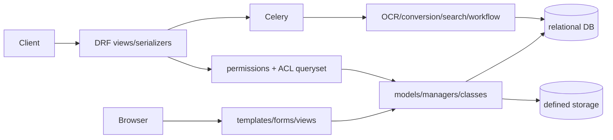

# System map

Mayan is one deployable Django project composed of domain apps. Framework composition lives in [base.py](../../mayan/settings/base.py#L43-L135); the worker loads tasks from installed apps in [celery.py](../../mayan/celery.py#L7-L11).

Ownership: UI is distributed across each app's `views`, `forms`, templates, and navigation registrations; API contracts live in `api_views` and `serializers`; domain/data live in models, managers, and classes; background work lives in `tasks.py`; cross-cutting security is `permissions` plus `acls`; tests live beside apps. HTTP routes and serializer fields are public contracts. Model internals, task choreography, hooks, and storage backends are private unless integrations rely on them.

Drill: pick `documents`, `sources`, and `ocr`; write one sentence each for what it owns and one thing it must not own. Strong answers identify a boundary crossing and its contract.
